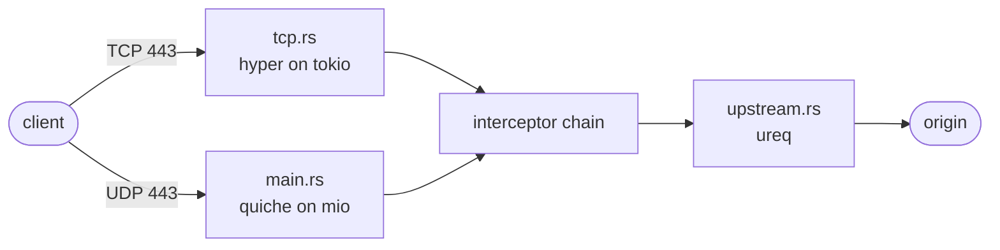
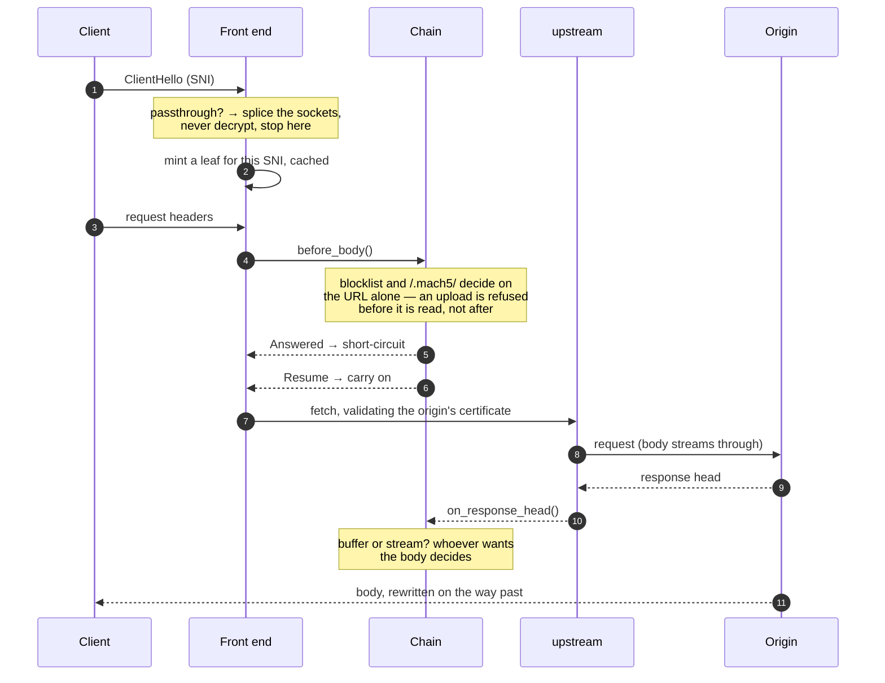

# How mach5 works

One page, aimed at whoever is about to change something or write a plugin.
Everything here is what the code does today; where a decision looks arbitrary
the reason is given, because the reason is usually the interesting part.

## The shape of it

Two front ends, one interceptor chain, one upstream client.



The QUIC side runs a synchronous [`mio`](https://docs.rs/mio) event loop that
owns every connection on the process. The TCP side runs `hyper` on a `tokio`
runtime on its own thread. They funnel into the same `Interceptor` chain and the
same upstream module, so a feature written once works on all three protocols.

**Why the codebase is otherwise synchronous:** `ureq` and plugin subprocesses
block. The TCP side confines async to hyper and uses `spawn_blocking` for the
rest, rather than converting everything to tokio for the benefit of one edge.

The TCP listener is not optional. HTTP/3 cannot bootstrap itself — a browser has
to learn about it from an `Alt-Svc` header on an existing connection — so every
client starts on TCP and moves itself across.

## The life of a request



### 1. The name, before anything is answered

A connection arrives and the first thing mach5 does is read the SNI out of the
ClientHello **with `peek`**, so the bytes stay in the socket. If the name is in
`[passthrough] hosts`, mach5 opens a socket to the real origin and copies bytes
between the two. No keys, no plaintext, no interceptors — and the client
validates the origin's own certificate itself. That is the only arrangement a
certificate-pinning app will accept.

A ClientHello no longer fits in one TCP segment, so this waits for the whole
record before deciding. Getting that wrong meant a listed host was decrypted or
not depending on packet timing.

QUIC cannot be spliced without reading an encrypted Initial, so for a listed host
the h3 handshake is refused instead and the client falls back to TCP.

### 2. A certificate, minted on the spot

Otherwise mach5 mints a leaf for that exact name, signed by your root, and
installs it on the live handshake. Leaves are cached in memory — bounded, LRU,
never written to disk — and minted *outside* the cache lock, because a keygen
inside the QUIC event loop stalls every other connection on the process.

### 3. The chain, in a deliberate order

```
LoopGuard → blocklist → /.mach5/ → inject → images → plugins → stamp
```

Every position is load-bearing:

- **LoopGuard first, and not configurable.** A request carrying mach5's own
  `x-mach5-via` marker is the proxy fetching itself — the wildcard-DNS failure —
  and it gets a 508 naming the resolver rather than recursing until the box dies.
- **Blocklist before plugins**, so a blocked request never reaches a plugin.
- **`/.mach5/` before plugins**, so a plugin never sees or answers the proxy's
  own endpoints.
- **Injection before plugins**, so a plugin sees the page as the origin wrote it
  rather than with mach5's tags already in it.
- **Images after injection, before plugins**, so a plugin looking at an image
  sees what the origin sent rather than a re-encoding of it.

The chain runs in **two phases**. `before_body` offers the request to every link
up to the first one that needs the body. The blocklist and the internal
endpoints decide on the URL alone, so in practice they answer while an upload is
still on the wire — the difference between declining a 2GB upload and swallowing
it first.

### 4. Fetching, and who is allowed to look

Upstream certificate validation is on. It is disabled in exactly one file,
`insecure.rs`, only for a host somebody typed the bypass phrase for, only for a
bounded time, only in memory, and every request taking that path is a `warn!`.

`accept-encoding` sent upstream is clamped to the intersection of what mach5 can
decode and what the client accepts — so a buffered body can always be decoded,
rewritten and re-encoded safely.

### 5. The body: buffered, or streamed

**Whoever wants the body decides.** `Interceptor::wants_body` is asked once per
response; if nothing claims it, the body streams in 64KB chunks and a 2MB
download never sits in memory.

`wants_body` defaults to `true` so a link that forgets to answer still works —
the cost being that every request-only link must opt out by hand or it silently
disables streaming for the whole proxy. That has happened once. There is a test
per built-in link asserting it stays opted out.

HTML is the interesting case: it is rewritten **as it streams**, through
`lol_html`, rather than held. Buffering pages cost time-to-first-byte of 1,258ms
against 46ms direct on a slow origin; streaming it is 47ms, which is what
fetching the origin costs.

### 6. Backpressure

A proxy has a fast side and a slow side and whatever sits between them fills up.

The TCP path gets this from a bounded channel per response: a worker filling it
faster than the client drains it parks, stops reading the origin, and TCP's own
flow control does the rest.

The QUIC path cannot copy that — one results channel carries every stream of
every connection, so bounding it would block unrelated clients behind one slow
one. It uses a per-stream credit system instead (`budget.rs`): a worker claims
room before handing a chunk over and the event loop returns it as bytes reach
quiche.

## Getting traffic to the proxy

mach5 only sees what is pointed at it. The deployment it is built for is a
wildcard resolver: something that answers *every* DNS query with mach5's
address, so every connection lands there and mach5 reads the SNI to learn which
origin was actually wanted.

`docker compose --profile dns up` runs one. Two things about it are worth
understanding rather than copying.

**The invariant.** mach5 must never resolve through that wildcard resolver. If
it did, every origin lookup would come back as mach5's own address and the proxy
would fetch itself forever. `compose.yaml` pins mach5's `dns:` at a real
resolver for exactly this reason, and `LoopGuard` answers a request carrying
mach5's own marker with a 508 naming the resolver — but that is a safety net,
not the design.

**Two resolvers, one host.** Port 53 is not shareable, so the wildcard resolver
and pi-hole cannot listen on the same address. They do not need separate
machines, only separate addresses, and you very likely already have a second
one: if clients arrive over WireGuard, the tunnel interface has an address of
its own. Bind the wildcard resolver there and leave pi-hole on the LAN address.

`MACH5_DNS_BIND` in `.env` is that address. Unset means "listen on everything",
which is right when pi-hole is on another machine.

A macvlan network is the other way to get an address without aliasing one — but
a macvlan container is unreachable from its own host, *including packets the
host forwards*, so it breaks the moment a VPN terminates on the same machine.
That is why it is not the default.

## Writing a plugin

See [`plugins/README.md`](../plugins/README.md) for the protocol. The three
things worth knowing before you start:

- **Your `match` filter decides what you see *and* whether the body is
  buffered.** Claim narrowly.
- **Chunks arrive still `content-encoding`d.** This is the thing to get wrong.
- **stdout is the protocol.** One reply per hook, matched by order, no request
  ids. A stray `print` desynchronises you permanently, so mach5 abandons a
  plugin that sends an unparsable line. Log to stderr.

## Things that will bite you

- quiche pins **boring 4.x** and only one crate may link BoringSSL. Use
  `tokio-boring` 4.x; 5.x pulls a second, conflicting `boring-sys`.
- hyper's `header_read_timeout` **silently breaks HTTP/1.1 unless a timer is
  set**. h2 keeps working, so it presents as an h1-only bug.
- Server connection IDs must be derived deterministically from the client DCID,
  or every Initial spawns a duplicate connection.
- The h3 fin is tracked separately from "upstream finished", because upstream
  usually finishes *after* the last chunk is written.
- **Startup takes about a second** because it launches plugin processes —
  `worker_threads` × 2 of them, since the QUIC pool and the TCP pool each build
  their own chain. A test script that fires immediately gets connection-refused.
